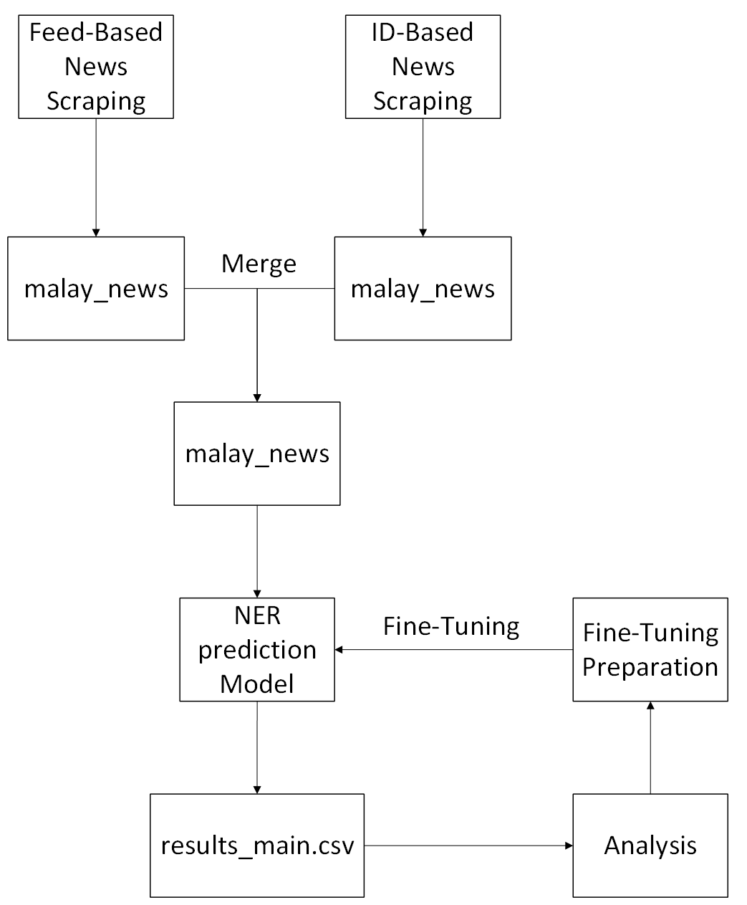

# NER for Malaysian news in Malay language

This repository includes:
1. scraper: to scrape Malaysian news online ([Feed-approach](#feed-approach))([ID-approach](#id-approach))
2. model_gliner (in progress): using the gliner model to predict labels on scraped news ([Labeling Prediction](#labeling-prediction))
3. tokenizer (for studying): to tokenize scraped news
4. transformer (for studying): for the NER model

## A.Architecutre


## B. Data Collection
<p align='justify'>News article are collected by using the scraper. There are two scrapers used - each using a slightly different approach. One is parsing the articles directly from the news feed. Another one is using random id's to find articles to parse.  Generally, to have more data overall, it would be better to use both approaches. One to provide more rows of data of different contexts, and the other for deeper insight on individual contexts. Best of both worlds!</p>

### Feed-approach
<p align='justify'>The `scraper/news_scraper_malay_feed.py` file excecutes the scraping multiple news websites feed pages. These are:</p>

- https://www.utusan.com.my/feed
- https://www.bharian.com.my/feed/
- https://www.hmetro.com.my/feed/
- https://www.kosmo.com.my/feed/ 
- https://www.astroawani.com/feeds/posts/default?alt=rss

<p align='justify'>Following this approach, while providing a quicker runtime and more articles per run, each of these articles can only provide the summary of the article, or even shorter. Since the articles are found on the feed page, there tends to be a "Read more..." at the end of the short summary, oftenly without finishing the last sentence. Another issue is that the articles that appear on the feed page updates ever so often. Meaning that this approach only works on the most recent of news, casting older ones out into the archive.</p>

### ID-approach
<p align='justify'>This approach uses the `scraper/news_scraper_malay_id.py` file. It scrapes news articles based on randomized id's. In this code, it gets the data from the https://www.utusan.com.my. This approach constructs a url using randomeized id's. Then it parses any articles that exists from that id. While this method gives a more dynamic reach of articles, going through randomized id's prolongs the runtime. Picture 100 scanned id's but only found 25 to be viable. However, the best part of this approach is that more text can be provided from each article. And, since the id's are random, it is safe to say that every article found for every run would be different. So, more article, more text! Given time can be spared.</p>

Before starting the parsing, configure the selectors. The code below is the configuration for the website used in this scraping, Utusan Malaysia.
```
# config
utusan_config = {
    "name": "Utusan Malaysia",
    "base_url": "https://www.utusan.com.my",    
    "id_param": "p",
    "id_range": (100000, 900000),           # for article id
    "num_ids_to_check": 100,                # number of id's to check
    "content_container_xpath": '//*[@id="content"]/div/div/section[3]/div/div/div[1]/div/div/div[5]/div',
    "title_selectors": [
        "h1.jeg_post_title",
        "h1.entry-title",
        "title"
    ],
    "date_selectors": [
        ".jeg_meta_date a", 
        "time.jeg_date",
        "span.jeg_date",
        ".date",
        "time.entry-date",
        "span.posted-on",
        "meta[property='article:published_time']",
        "meta[name='date']"
    ],
    "category_selectors": [
        ".jeg_meta_category a",
        "a.jeg_meta_category",
        ".category",
        "a[rel='category tag']",
        ".post-categories a",
        "span.cat-links a",
        "meta[property='article:section']"
    ]
}

```
Then, random id's can be generated and used to make the url. This url is for the code refer to when it is looking for news articles.
```
# get random id's
random_ids = random.sample(range(utusan_config['id_range'][0], utusan_config['id_range'][1]), utusan_config['num_ids_to_check'])
```

This code below is to make the url, check, parse, and extract existing news articles. If the webpages that has not content, leads to the homepage, or simply do not exist will be skipped. It also ends the text extraction on a sentence. This is to avoid having incomplete words.
```
news_items = []
articles_found = 0
articles_excluded = 0

# go through every id generated
for article_id in random_ids:
    try:
        # make a url using the id
        article_url = f"{utusan_config['base_url']}/?{utusan_config['id_param']}={article_id}"
        
        # fetch the article based on made url
        response = requests.get(article_url, timeout=20)
        response.raise_for_status()
        
        # detect encoding if there isn't any
        if response.encoding is None:
            detected_encoding = chardet.detect(response.content)['encoding']
            if detected_encoding:
                response.encoding = detected_encoding
        
        # skip if redirected to homepage
        if response.url == utusan_config['base_url'] + "/" or response.url == utusan_config['base_url']:
            continue
            
        # parse article
        soup = BeautifulSoup(response.text, 'html.parser')
        tree = html.fromstring(response.content)
        
        # extract title
        title = ""
        for selector in utusan_config['title_selectors']:
            try:
                element = soup.select_one(selector)
                if element:
                    title_text = element.get_text().strip()
                    if title_text and title_text != utusan_config['name']:
                        title = title_text
                        break
            except Exception:
                continue
        
        if not title:
            continue
            
        # extract date
        pub_date = ""
        for selector in utusan_config['date_selectors']:
            try:
                # Handle meta tags differently
                if selector.startswith("meta["):
                    element = soup.select_one(selector)
                    if element and element.has_attr('content'):
                        pub_date = element['content'].strip()
                        if pub_date:
                            # Format date from meta tag if needed
                            if "T" in pub_date:
                                pub_date = pub_date.split("T")[0]
                            break
                else:
                    element = soup.select_one(selector)
                    if element:
                        pub_date = element.get_text().strip()
                        if pub_date:
                            break
            except Exception:
                continue
        
        # extract category -- results are empty
        category = ""
        for selector in utusan_config['category_selectors']:
            try:
                # Handle meta tags differently
                if selector.startswith("meta["):
                    element = soup.select_one(selector)
                    if element and element.has_attr('content'):
                        category = element['content'].strip()
                        if category:
                            break
                else:
                    element = soup.select_one(selector)
                    if element:
                        category = element.get_text().strip()
                        if category:
                            break
            except Exception:
                continue
        
        # extract content
        full_content = ""
        try:
            # get XPATH
            container = tree.xpath(utusan_config['content_container_xpath'])

            # get paragraphs
            if container:
                paragraphs = container[0].xpath('.//p')
                
                for p in paragraphs:
                    text_elements = p.xpath('.//text()')
                    paragraph_text = " ".join(text.strip() for text in text_elements if text.strip())
                    
                    # preserve paragraph breaks
                    if paragraph_text:
                        full_content += paragraph_text + "\n\n" 

        except Exception as e:
            logging.warning(f"XPath extraction failed for ID {article_id}: {str(e)}")
        
        # if XPATH failed
        if not full_content.strip():
            try:
                # alternative CSS selectors
                selectors = ['.jeg_post_content', '.entry-content', '.article-content', '.post-content', '.content']
                for selector in selectors:
                    try:
                        content_element = soup.select_one(selector)
                        if content_element:
                            paragraphs = content_element.find_all('p')
                            for p in paragraphs:
                                text = p.get_text(strip=True)
                                if text:
                                    full_content += text + "\n\n"
                            if full_content.strip():
                                break
                    except Exception:
                        continue
            except Exception:
                pass
        
        # strip content extraction
        full_content = full_content.strip()
        
        # skip if content is not found
        if not full_content:
            articles_excluded += 1
            logging.warning(f"Skipping article ID {article_id} - no content found")
            continue
            
        # end on sentence
        last_punct = max(
            full_content.rfind('.'),
            full_content.rfind('!'),
            full_content.rfind('?')
        )
        
        if last_punct != -1:
            summary = full_content[:last_punct + 1]
        else:
            summary = full_content
        
        # add to dataset
        news_items.append({
            "News_Source": utusan_config['name'],
            "Title": title,
            "Source_URL": response.url,
            "Publish_Date": pub_date,
            "Category": category,
            "Summary": summary,
            "Scrape_Date": date_str     # same as in file name
        })
        
        articles_found += 1
        time.sleep(random.uniform(1.0, 2.5))    # adjust delay
        
    except RequestException as e:
        logging.warning(f"Request failed for ID {article_id}: {str(e)}")
        time.sleep(3)  
    except Exception as e:
        logging.error(f"Error processing ID {article_id}: {str(e)}")
        time.sleep(1.5)
```
Finally, convert the extraction into a DataFrame, and then save into a csv and parquet files.
```
# create df
df = pd.DataFrame(news_items)

# save file
df.to_csv(csv_filename, index=False, encoding='utf-8-sig')
df.to_parquet(parquet_filename, index=False)
```

### Handling Mutiple Files of Data
<p align='justify'>The `scraper/join_csv.py` was made to join all the csv and parquet files into one file respectively. This is easen the data cleaning and preparation for the NER model. The merged file will be saved at `model_gliner/malay_news.csv` and `model_gliner/malay_news.parquet` resepectively.</p>

## C. Data Labeling
<p align='justify'>The labels that will be used for this model is as follows:

|  Label  |  Entity  |
|  ---    |  ---     |
|GPE|Geopolitical| 
|PERSON|People
|ORG|Organization
|FAC|Facility
|MONEY|Monetary
|NORP|Nationalities/ Religious/ Political Groups 
|LOC|Location
|PRODUCT|Products
|EVENT|Events
|PERCENT|Percentage
|WORK_OF_ART|Titles of Creative Works
|TIME|Time
|ORDINAL|Sequence Numbers
|CARDINAL|Counting Numbers
|QUANTITY|Measurements
|LAW|Law Documents|

### Labeling Prediction
<p align='justify'>The `model_gliner/prediction_main.ipynb` file will be used to predict the labels on the text data gathered from the news scraping in Part A. Here, The `model_gliner/malay_news.parquet` file is extracted of its title and summary column entries. These extractions are put in seperate sentences into a txt file. The txt file, `model_gliner/malay_news_corpus.txt`, is then used with the gliner model for the prediction. The specific gliner used for this is the `urchade/gliner_multi`, which supports the Malay language.</p>

### Running
scraper/news_scraper_malay_feed.py --> scraper/news_scraper_malay_id.py --> scraper/join_csv.py --> model_gliner/prediction_main.ipynb

## D. Prediction Analysis
`model_gliner/prediction_analysis.ipynb`
